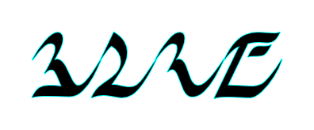

Myst Alphanumericals
=========================
Alphanumericals or Alphanumeric characters are any collection of number characters and letters in a certian language.  

These will create images of the alphanumeric characters found in the Myst game series.

dni_spell_numbers.py  
-------------------
Convert a decimal to base 25, then map to the NTStandard and draw an image using the D'ni font.
Uses the *Dni Font created by Cyan.*  

dni_numerals.py  
---------------
Convert a decimal to base 25 then draw an image of the D'ni numerals. Uses the *Dni Font created by Cyan.*  

narayani_numerals.py  
--------------------
Convert a decimal to the number system from Saavedro's journal found in Myst III: Exile. Uses the *Narayani Light font created by Jehon aka. Sebastian Ochs.*  

narayani_words.py   
-----------------
Create an image using Narayani words as seen in Myst III: Exile. Uses the *Narayani Light font created by Jehon aka. Sebastian Ochs.*  

    2024-06-08
    stone@stone-shard.com
    Stone
